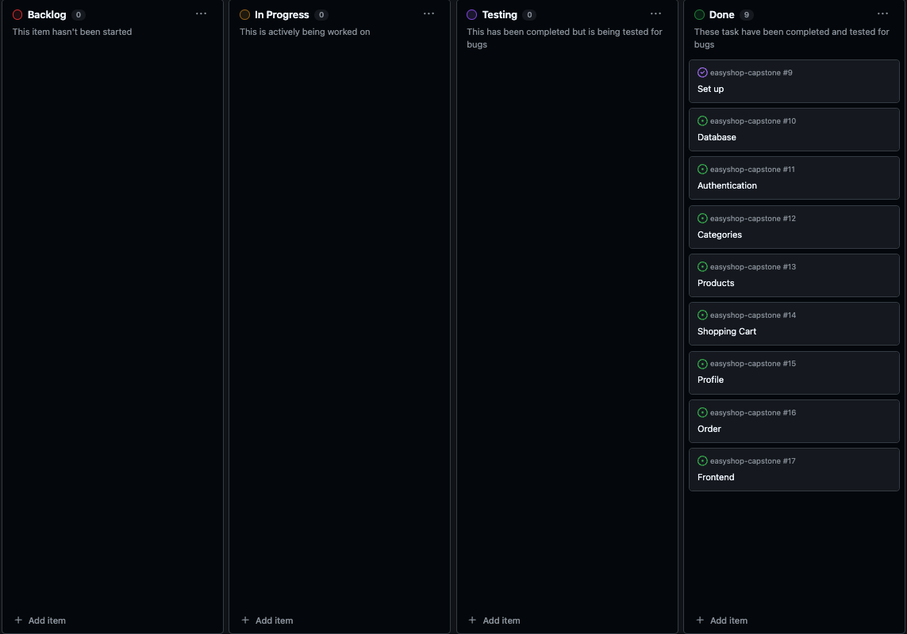
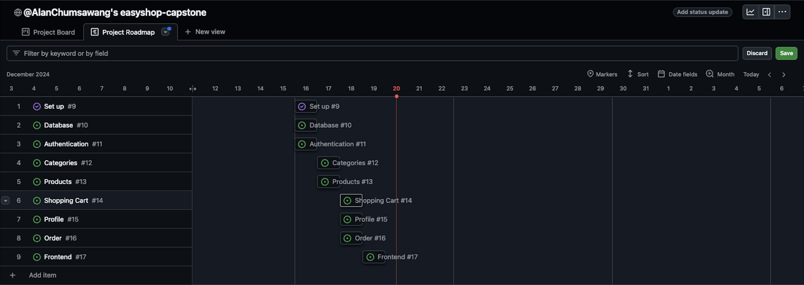

# Capstone 3: EasyShop

## Index
1. [Overview](#1-overview)
2. [How to Run](#2-how-to-run)
3. [Planning Project Board/Roadmap](#3-planning-project-boardroadmap)
4. [UML](#4-uml)
5. [Approach](#5-approach)
6. [Challenges](#6-challenges)
7. [Solutions](#7-solutions)
8. [Lessons Learned](#8-lessons-learned)

## 1. Overview
This project is an E-Commerce application built using Java, Spring Boot, and MySQL. It features a RESTful API backend
that manages categories, products, shopping carts, profiles, and orders. The application provides basic CRUD operations
and user authentication, allowing users to browse and purchase products.

---

## 2. How to Run

### Prerequisites
- Java Development Kit (JDK 17 or later)
- MySQL Database
- Postman (optional for API testing)
- An IDE such as IntelliJ IDEA or Eclipse

Change the following properties in the `application.properties` file:
- `spring.datasource.url=jdbc:mysql://localhost:3306/`
- `spring.datasource.username=<your-username>`
- `spring.datasource.password=<your-password>`

### Steps
1. Clone the repository:
   ```bash
   git clone <repository-url>
   cd <repository-directory>
   ```

2. Run the application:
   ```bash
   ./mvnw spring-boot:run
   ```

3. Open Postman and test the API endpoints:
    - API: `http://localhost:8080`
    - Frontend: `http://localhost:8080/index.html`

## 3. Planning Project Board/Roadmap

### Project Board
I organized the project using a GitHub Project board with the following columns:
- Backlog: Tasks to be done
- In Progress: Tasks currently being worked on
- Review: Tasks awaiting review
- Done: Completed tasks



### Roadmap
- **Day 1**: Set up environment, authentication, and database connectivity.
- **Day 2**: Implement Categories and Products APIs.
- **Day 3**: Complete Shopping Cart, Profile, and Orders, followed by integration testing.



## 4. UML
The UML diagram illustrates the structure and interactions between the API endpoints, controllers, DAOs, and models in
the EasyShop application, detailing the relationships and methods within each component.


## 5. Approach

### Development Phases
- **Authentication**: Added register and login endpoints to secure the API.
- **CRUD Operations**: Built RESTful APIs for categories, products, shopping cart, profile, and orders.
- **Filtering**: Implemented product filtering using query parameters.
- **Testing**: Used Postman to test API endpoints and verify functionality.

### Tools Used
- Spring Boot: Backend framework
- MySQL: Database management
- Postman: API testing
- GitHub Projects: Task management

## 6. Challenges
- **Database Connection Issues**: Initially, the application couldn't connect to MySQL due to misconfigured properties.
- **Filtering Logic**: Implementing dynamic query parameters for products was more complex than anticipated.
- **Time Management**: Completing the project within three days required focused effort and efficient task prioritization.

## 7. Solutions
- Resolved database connection issues by carefully reviewing the `application.properties` file.
- Used `@RequestParam` annotations in Spring Boot to handle dynamic product filters.
- Adopted a prioritized task list and utilized short feedback loops for faster progress.

## 8. Lessons Learned
- Using `@CrossOrigin` and `@PreAuthorize` annotations in Spring Boot to handle cross-origin requests and secure endpoints.
    - **`@CrossOrigin`**: This annotation is used in Spring Boot to handle Cross-Origin Resource Sharing (CORS). It allows your backend to accept requests from different origins, which is essential for enabling frontend applications hosted on different domains to interact with your API.
        - Example: See `AuthenticationController.java` in the `org.yearup.controllers` package.
    - **`@PreAuthorize`**: This annotation is used to secure methods in your application. It ensures that only authenticated users can access certain endpoints. For example, `@PreAuthorize("isAuthenticated()")` ensures that the method can only be accessed by authenticated users.
        - Example: See `OrdersController.java` in the `org.yearup.controllers` package.
- Leveraging Spring methods for efficient development and integration.
    - **Spring Methods**: Spring Boot provides a variety of methods and annotations that simplify the development process. For example, `@Autowired` for dependency injection, `@RequestMapping` for mapping web requests to specific handler methods, and `@RequestParam` for extracting query parameters from requests.
        - Example: See `ProductsController.java` in the `org.yearup.controllers` package.
- Conducting thorough API testing with Postman to ensure endpoint functionality.
    - **Postman**: This tool is used for testing API endpoints. It allows you to send HTTP requests to your API and verify the responses. You can create collections of requests, automate tests, and even generate documentation for your API.
        - Example: See `README.md` section "How to Run" for instructions on testing with Postman.
- Developing the frontend using HTML and JavaScript to create a seamless user experience.
    - **HTML and JavaScript**: These are the core technologies for frontend development. HTML is used to structure the content of web pages, while JavaScript is used to create dynamic and interactive user experiences. Together, they enable you to build a seamless user interface for your application.
        - Example: See `index.html` and related JavaScript files in the `easyshop-frontend` directory.
- Utilizing Java Streams for efficient data processing.
    - **Streams**: Java Streams provide a powerful way to process collections of data. They allow for operations such as filtering, mapping, and reducing, which can be chained together to create concise and readable code. For example, using `stream().filter().map().collect()` to process a list of products.
        - Example: See `ShoppingCartController.java` in the `org.yearup.controllers` package.
    
```